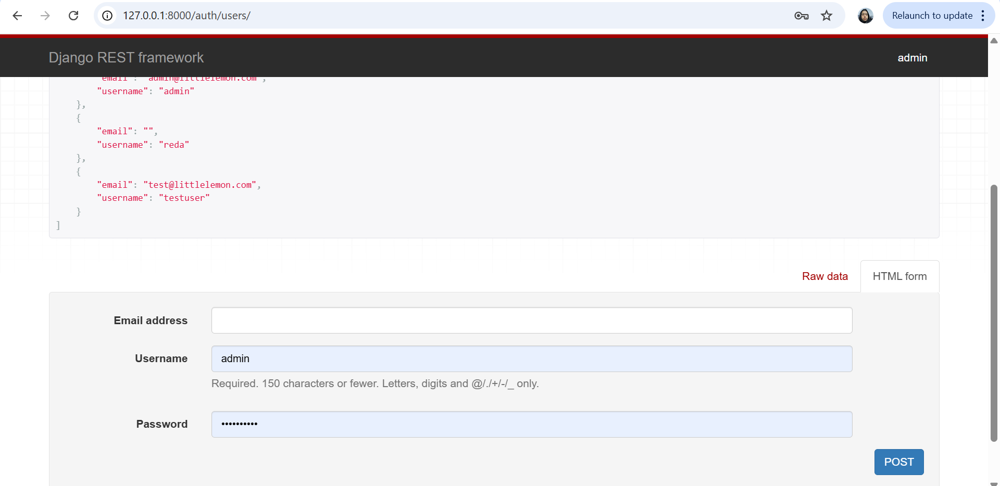

# 🍋 Little Lemon Restaurant Booking System

This project is my **Final Capstone Project** for the Django Back-End Developer course.
It demonstrates how to build a booking system using **Django, Django REST Framework, MySQL, and API endpoints**.

---

## 📌 About the Project
The project was developed to test knowledge of back-end development with Django.
It connects a Django back-end to a MySQL database and exposes REST API endpoints for:

- **Menu management**
- **Table bookings**
- **User registration & authentication**

Main goals:
- Implement REST APIs with Django REST Framework.
- Connect and manage data in a MySQL database.
- Authenticate users and secure API endpoints.
- Test APIs using **Insomnia/Postman**.

---

## 🚀 Features

1. **MySQL Integration**
   - Configured Django to use MySQL as the main database.  
   - Migrated all models into MySQL.  

2. **Menu API**  
   - CRUD operations for menu items (`/restaurant/menu-items/`).  
   - Authentication required for creating, updating, and deleting.  

3. **Booking API**  
   - CRUD operations for restaurant bookings (`/restaurant/booking/tables/`).  
   - Allows customers to view or manage their reservations.  

4. **User Management**  
   - Registration and login system with **Djoser**.  
   - Token-based authentication for secure access.  

---

## 🛠️ Technologies Used  

- **Backend:** Django, Django REST Framework  
- **Database:** MySQL  
- **Authentication:** Djoser + Token Authentication  
- **Testing:** Insomnia/Postman  
- **Environment:** Virtualenv / venv  

---

## 📸 Screenshots  

### 🔑 Authentication

**Register User (POST-GET /auth/users/)**  
  
  

**Create Token (POST /restaurant/api-token-auth/)**  


**Login (POST /auth/token/login/)**  


**Logout (POST /auth/token/logout/)**  
  

---

### 🍽️ Menu Items  

**GET /restaurant/menu-items/** – Fetch all menu items without Token
  

**GET /restaurant/menu-items/** – Fetch all menu items With Token
  

**POST /restaurant/menu-items/** – Add new menu item  
  

**PUT /restaurant/menu-items/1** – Update a menu item  
  

**DELETE /restaurant/menu-items/1** – Delete a menu item  
  

---

### 📅 Bookings  

**GET /restaurant/booking/tables/** – Fetch all bookings  
  

**POST /restaurant/booking/tables/** – Add new booking  
  

**PUT /restaurant/booking/tables/1** – Update a booking  
  

**DELETE /restaurant/booking/tables/1** – Delete a booking  
  

---

### 📅 Test Models With UnitTest  

**UnitTest** – Test Models With UnitTest
  

---

## ⚙️ Setup Instructions  

### 1. Clone the repo  
```bash
git clone https://github.com/redasalimi/Little-Lemon.git
cd Little-Lemon
